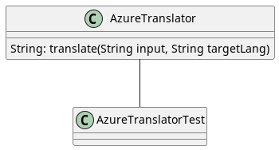

---
title: Chmurowe usługi AI
subtitle: Tłumacze - ćwiczenia
author: Piotr JANKOWSKI
papersize: a4
...

# 01 Tłumacze

## Wstęp

Jako przykład zaimplementowane jest wywołanie usługi `Azure Translator`.



Klasa `AzureTranslator` zawiera kod integrujący się z usługą chmurową
w Azure z wykorzystaniem REST API.

Klasa `AzureTranslatorTest` zawiera test integracyjny dla odpowiadającej
mu klasy. Jest to jeden przypadek typu _happy path_.

Uwierzytelnianie odbywa się za pomocą klucza uwierzytelniającego. Aplikacja
wczytuje ten klucz ze zmiennej środowiskowej `AZURE_TRANSLATOR_KEY`.

## Wymagania

Wymagania poniżej dotyczą wszystkich zadań (patrz niżej).

1. Klucze uwierzytelniające nie mogą w żadnym momencie być umieszczone w kodzie aplikacji ani w repozytorium git (!)
2. Poprawność działania kodu powinna być sprawdzana testem integracyjnym.
3. Rekomendowany sposób umieszczenia rozwiązań na gicie: najpierw jeden _commit_ z wersją "zero" (bez zmian) a następnie kolejne _commity_ z rozwiązaniami np. jeden na zadanie. Ułatwi to sprawdzanie.

Dokładne wymagania znajdują się w opisie poszczególnych zadań.

## Zadania

### Uruchomić aplikację przykładową

Skompilować i uruchomić kod korzystający z udługi Azure Translator w folderze `azure`.

Ustawić zmienną środowiskową `AZURE_TRANSLATOR_KEY` zawierającą klucz
uwierzytelniający do usługi (wartość klucza u prowadzącego).

Uruchomić ponownie - test powinien zakończyć się sukcesem.

### Na bazie przykładowej aplikacji dla Azure, stworzyć aplikację dla DeepL

Wykorzystać REST API. Dokumentacja:

* <https://www.deepl.com/docs-api/introduction>
* <https://editor.swagger.io/?url=https://raw.githubusercontent.com/DeepLcom/openapi/main/openapi.yaml>

Wykorzystać to samo zdanie testowe.

Skonfigurować uwierzytelnianie za pomocą zmiennej środowiskowej (np. `DEEPL_KEY`). 
Wartość zmiennej można uzyskać u prowadzącego.

Stworzyć testy integracyjne korzystające z tego samego zdania wejściowego,
dla przynajmniej dwóch różnych języków wyjściowych.

Umieścić w repozytorium kod źródłowy integracji z DeepL za pomocą REST oraz kod źródłowy testu.

### Wykorzystując SDK, stworzyć aplikację dla AWS Translate

Nie korzystać z REST API, ale z AWS SDK.

Wykorzystać to samo zdanie testowe.

Wykorzystać `aws/src/main/java/AwsTranslate.java`.

Skonfigurować uwierztelnianie za pomocą zmiennych środowiskowych.
Nazwy zmiennych znaleźć w dokumentacji usługi AWS Translate. Wartości zmiennych - od prowadzącego.

Umieścić w repozytorium kod źródłowy integracji z AWS Translate za pomocą SDK oraz kod źródłowy testu.

### Korzystając z AWS Translate przetłumaczyć dłuższy tekst

Wykorzystać `aws/src/main/java/AwsTranslateAuthor.java`.

Pobrać notkę biograficzną na temat Adama Mickiewicza przez REST API serwisu wolnelektury.pl

```bash
curl -L -s https://wolnelektury.pl/api/authors/adam-mickiewicz | jq -r '.description'
```

Jeśli korzystasz z `curl`, co się stanie, gdy nie będzie flagi `-L` i dlaczego? Odpowiedź umieść w pliku `ODPOWIEDZI.txt` w katalogu głównym repozytorium.

Przetłumaczyć notatkę na inny dowolny język.

**UWAGA**: Jako język źródłowy należy wskazać język polski (`pl`).

Zwróć uwagę, że część tytułów dzieł Mickiewicza jest przetłumaczona a część nie.

Korzystając z flagi `do not translate`, wyłączyć tłumaczenie tytułów. Dla uproszczenia,
możesz założyć, że wszystkie teksty w tagu `<i>` mogą nie być tłumaczone.

Przeanalizować uzyskane tłumaczenie. Co jeszce można by poprawić i w jaki sposób?

Umieścić w repozytorium kod źródłowy integracji z AWS Translate za pomocą SDK oraz kod źródłowy testu.

### Przetłumaczyć notatkę o A. Mickiewiczu za pomocą DeepL

Przetłumaczyć notatkę za pomocą DeepL na ten sam język, co za pomocą AWS Translate.

Porównać rezultat z AWS Translate.

### (Opcjonalnie)

Napisać aplikację pobierającą "bezużyteczny fakt dnia" z serwisu Useless facts.

```bash
curl https://uselessfacts.jsph.pl/today.json?language=de
```

Korzystając z dowolnej usługi do tłumaczeń przetłumaczyć pobrany fakt na dowolny
wspierany język.

## Podsumowanie

* Umieścić w repozytorium kod źródłowy integracji z DeepL za pomocą REST oraz kod źródłowy testu.
* Umieścić w repozytorium kod źródłowy integracji z AWS Translate za pomocą SDK oraz kod źródłowy testu.
* (opcjonalnie) Co się stanie, gdy nie będzie flagi `-L` w wywołaniu `curl` i dlaczego? Odpowiedź umieść w pliku `ODPOWIEDZI.txt` w katalogu głównym repozytorium.
* Umieścić w repozytorium kod źródłowy tłumaczący notatkę biograficzną przez AWS Translate za pomocą SDK oraz kod źródłowy testu.
* W pliku `ODPOWIEDZI.txt` w katalogu głównym repozytorium odpowiedzieć na pytanie, czy i jak można jeszcze ulepszyć tłumaczenia za pomocą AWS Translate.
* W pliku `ODPOWIEDZI.txt` w ktalogu głównym repozytorium krótki porównać tłumaczenie tej samej notatki biograficznej za pomocą AWS Translate i DeepL.
* (opcjonalnie) Umieścić w repozytorium kod tłumaczący "bezużyteczny fakt dnia".
